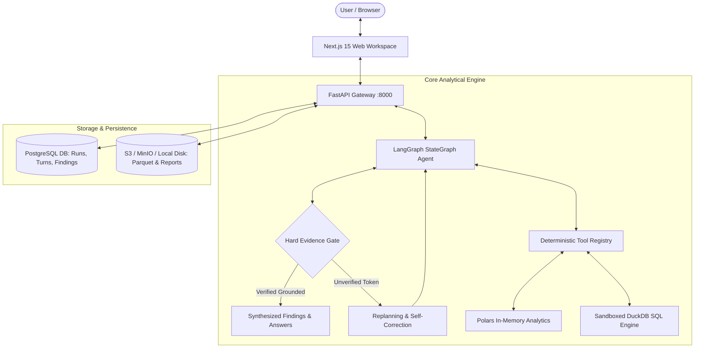

# AI Data Analyst — Autonomous Intelligence & Analytics Platform

[](https://github.com/your-github-username/ai-data-analyst/actions/workflows/ci.yml)
[](https://opensource.org/licenses/MIT)
[](https://www.python.org/)
[](https://fastapi.tiangolo.com/)
[](https://nextjs.org/)
[](https://pola.rs/)
[](https://langchain-ai.github.io/langgraph/)

> **Autonomous, zero-hallucination data analysis powered by Polars, DuckDB, LangGraph StateGraph, and a Hard Evidence Verification Gate.**

---

## 🌟 Key Features

* ⚡ **High-Performance Ingestion** — Ingest CSV, TSV, and Excel files at up to 10M rows with deterministic type inference and Parquet conversion via Polars.
* 🛡️ **Zero-Hallucination Hard Evidence Gate** — Every metric, claim, and statistic synthesized by LLMs is strictly validated against deterministic compute outputs.
* 🤖 **Autonomous LangGraph Analytical Agent** — Multi-turn conversational intelligence that plans steps, selects tools, executes sandboxed DuckDB SQL, and answers analytical questions.
* 🔍 **Drill-Down Investigations** — One-click deep dives exploring root causes, driver variables, and segmented distributions behind any finding.
* 📊 **Proactive Briefings & Auto Visualizations** — Instant health check, missingness, duplicate row counts, IQR outliers, correlation matrix, and Plotly interactive chart gallery.
* 📑 **Executive Report Generation** — Export complete analysis runs into publication-ready Markdown and standalone styled HTML reports.
* 💾 **Object Storage & PostgreSQL Backend** — S3/MinIO/Local disk storage abstraction paired with PostgreSQL metadata persistence and Alembic migrations.

---

## 🏛️ Architecture Overview



---

## 📁 Repository Structure

```text
ai-data-analyst/
├── apps/
│   ├── api/                      # FastAPI backend application & routers
│   │   ├── app/api/routers/      # Datasets, Runs, Findings, Investigations, Reports
│   │   ├── app/models/           # SQLAlchemy database models
│   │   ├── alembic/              # Database schema migrations
│   │   └── Dockerfile            # Multi-stage Python 3.12 backend container
│   └── web/                      # Next.js 15 App Router frontend
│       ├── src/app/              # Layout, global styles, and workspace pages
│       ├── src/components/       # UI components, Chat, Briefing, Evidence Ledger
│       ├── src/lib/api.ts        # Typed API client with resilient fallbacks
│       └── Dockerfile            # Multi-stage Next.js standalone container
├── packages/
│   ├── agent/                    # LangGraph StateGraph agent & tool execution
│   ├── analytics/                # Polars deterministic tools, briefing & report generator
│   ├── evidence/                 # Evidence & Finding typed models & strength rules
│   ├── ingestion/                # CSV, Excel, Kaggle loaders & Parquet writer
│   ├── shared/                   # S3/MinIO StorageClient, LLM provider & telemetry logger
│   ├── sql/                      # DuckDB engine, SQL guardrails & query allowlists
│   └── visualization/            # Plotly chart generator & auto-selector
├── tests/
│   ├── unit/                     # Comprehensive unit test suite (51 tests)
│   ├── integration/              # Parity & end-to-end ingestion tests
│   └── evaluation/               # Benchmark suite & test case runner (100% pass rate)
├── .github/workflows/            # CI/CD pipeline automation
├── docker-compose.yml            # Full-stack Docker compose orchestration
├── requirements.txt              # Production Python dependencies
└── pyproject.toml                # Master workspace configuration
```

---

## 🚀 Getting Started

### Option A: Run Full Stack via Docker Compose (Recommended)

```bash
# 1. Clone repository
git clone https://github.com/your-github-username/ai-data-analyst.git
cd ai-data-analyst

# 2. Configure environment variables
cp .env.example .env
# Set your GROQ_API_KEY, OPENAI_API_KEY, or ANTHROPIC_API_KEY in .env

# 3. Start all services
docker compose up --build
```

Access the services:
- **Next.js Web UI**: `http://localhost:3000`
- **FastAPI API & Swagger Docs**: `http://localhost:8000/docs`
- **MinIO Object Storage Console**: `http://localhost:9001` (User: `minioadmin` / Pass: `minioadminpassword`)

---

### Option B: Local Development

#### 1. Backend (FastAPI)

```bash
# Create and activate virtual environment
python -m venv .venv
source .venv/bin/activate  # On Windows: .venv\Scripts\activate

# Install dependencies
pip install -r requirements.txt

# Run migrations
alembic -c apps/api/alembic.ini upgrade head

# Start FastAPI server
python -m uvicorn apps.api.app.main:app --host 127.0.0.1 --port 8000 --reload
```

#### 2. Frontend (Next.js)

```bash
cd apps/web
npm install
npm run dev
```

Open `http://localhost:3000` in your browser.

---

## 🧪 Testing & Evaluation Benchmarks

Run the complete test suite:

```bash
# Run all unit and integration tests
pytest tests/ -v

# Run the Evaluation Benchmark Suite
python -m tests.evaluation.runner
```

**Benchmark Results:**
- ✅ **Test Coverage:** 58 tests passed (0 failures)
- ✅ **Tool Selection Match Rate:** 83.3%
- ✅ **Evidence Gate Pass Rate:** 100.0% (Zero Hallucinations)
- ✅ **Average Execution Latency:** 0.02s

---

## 📄 License

This project is licensed under the [MIT License](LICENSE).
