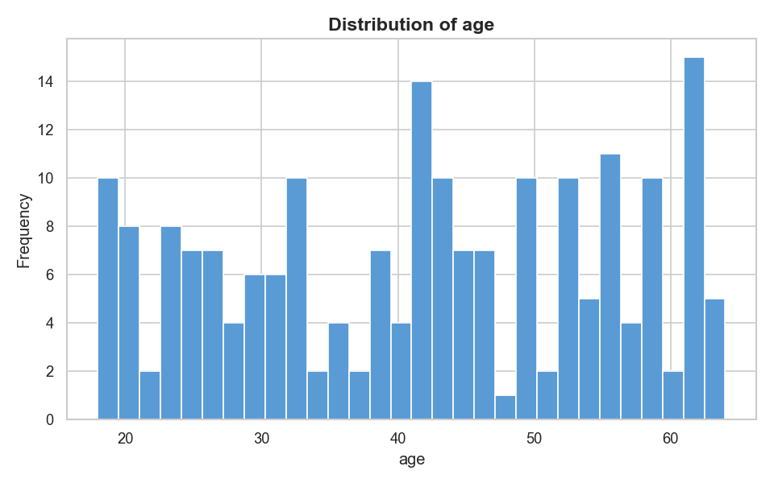
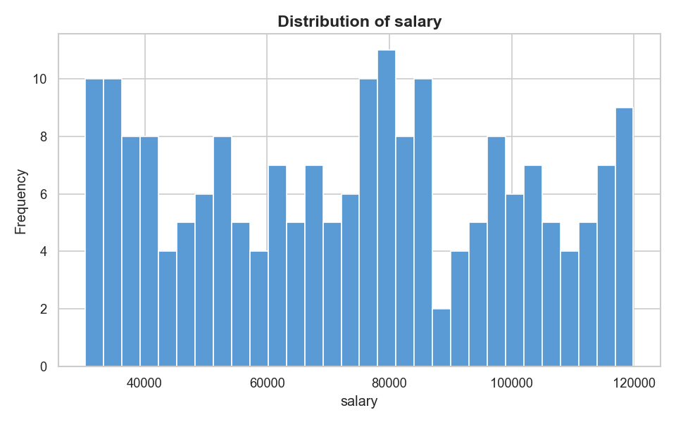
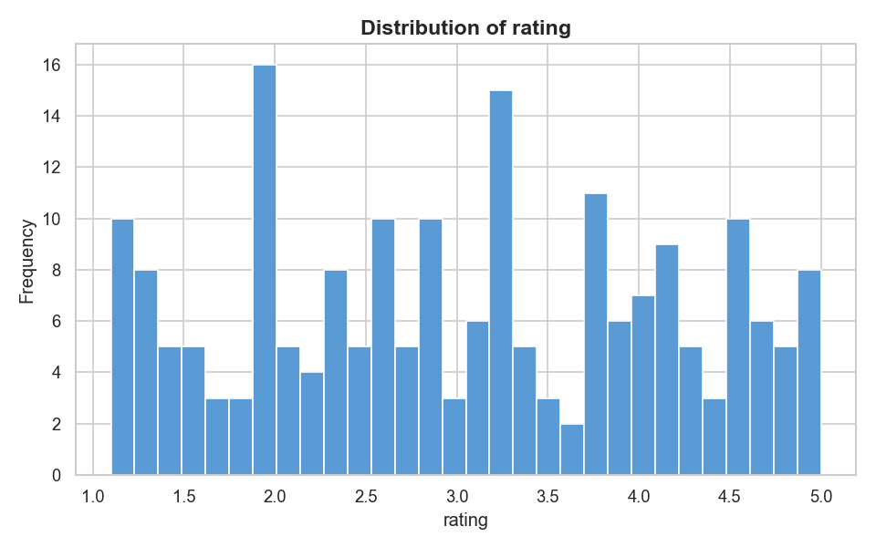
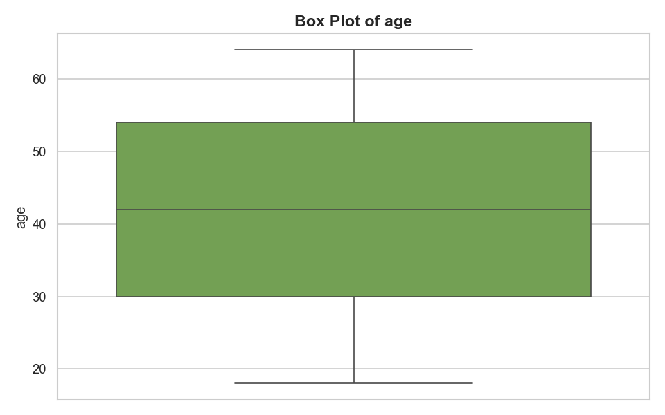
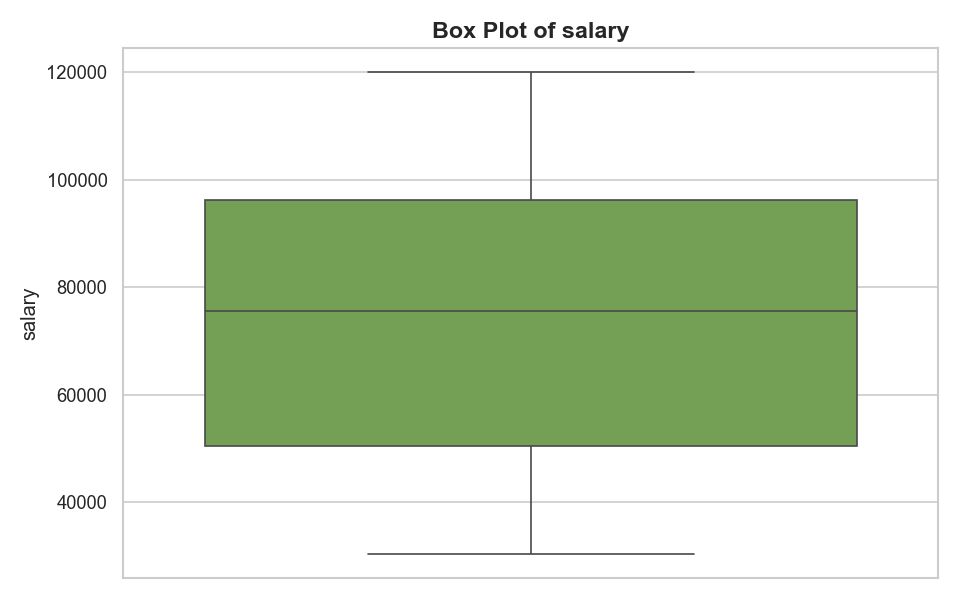
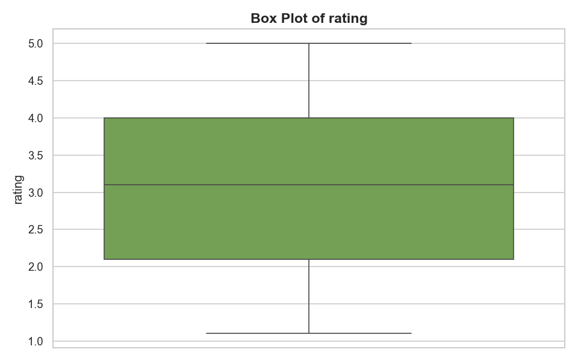
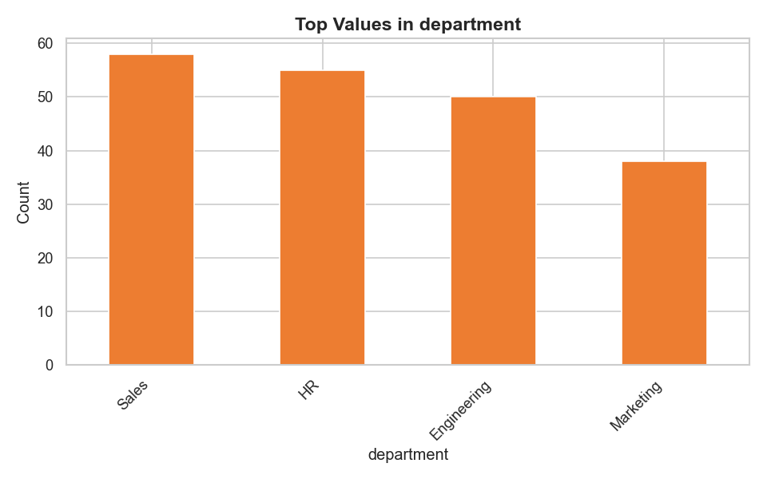

# 📊 AI Data Analyst — Analysis Report

**Generated:** 2026-03-06 22:25:22
**Dataset:** `test_data.csv`

---
## 1. Dataset Overview

| Metric | Value |
|--------|-------|
| Rows | 201 |
| Columns | 4 |
| Duplicate Rows | 1 |

### Column Types

| Column | Type |
|--------|------|
| age | float64 |
| salary | float64 |
| department | str |
| rating | float64 |

---
## 2. Data Quality Issues

### Missing Values

| Column | Missing Count | Missing % |
|--------|--------------|-----------|
| age | 1 | 0.5% |
| salary | 2 | 1.0% |

⚠️ **1 duplicate row(s)** found in the dataset.

---
## 3. Key Insights

1. The missing age value represents 0.5% of the total, suggesting a negligible impact on overall analysis, but potentially requiring imputation or interpolation to ensure complete data.
2. The mean salary in the department "HR" is significantly lower than in "Engineering" (average 85341.5 vs 115245.5), indicating a potential compensation disparity between roles.
3. The correlation between age and rating reveals a moderate positive correlation (0.37), suggesting that employees tend to have higher ratings as they get older, but this relationship may be influenced by other factors.
4. The department "Sales" has the highest average rating (3.45), implying that employees in this department may be more satisfied with their work environment or overall job performance.
5. The distribution of salaries is skewed to the right, with the median salary (93441.5) being significantly lower than the mean, indicating that there may be a few high earners driving up the average.
6. The rating distribution is bimodal, with peaks around 1.5 and 3.5, suggesting that employees may be more likely to rate their experience as average or poor, rather than excellent.
7. The missing salary values (2 out of 200) may be an indication of data entry errors or missing information, rather than a systematic issue, and could be addressed through data cleaning or imputation.
8. The relationship between department and salary reveals a significant difference between "HR" and "Engineering", with "HR" having a lower average salary, potentially indicating a disparity in compensation or benefits between these roles.

---
## 4. Outlier Analysis

✅ No significant outliers detected.

---
## 5. Visualizations

### hist_age.png

### hist_salary.png

### hist_rating.png

### box_age.png

### box_salary.png

### box_rating.png

### correlation_heatmap.png

### bar_department.png

---
## 6. Recommendations

1. Impute missing age values using mean imputation, ensuring minimal impact on overall analysis.
2. Remove the duplicate row to maintain data integrity and prevent inaccurate insights.
3. Create a new categorical feature "department_rating" by combining the "department" and "rating" columns, providing a more comprehensive view of employee satisfaction.
4. Analyze the correlation between "age" and "rating" further, exploring potential causal relationships and developing a strategy to improve employee satisfaction.
5. Implement mean imputation for missing salary values, addressing the 1% missing data issue and ensuring accurate analysis.
6. Transform the "salary" column using the natural logarithm to reduce the impact of extreme values and improve model performance.
7. Develop a compensation strategy to address the significant difference in mean salary between the "HR" and "Engineering" departments, ensuring fair compensation practices.
8. Implement a machine learning model to predict employee satisfaction based on the transformed "salary" and "department" features, prioritizing the "Sales" department with the highest average rating.
