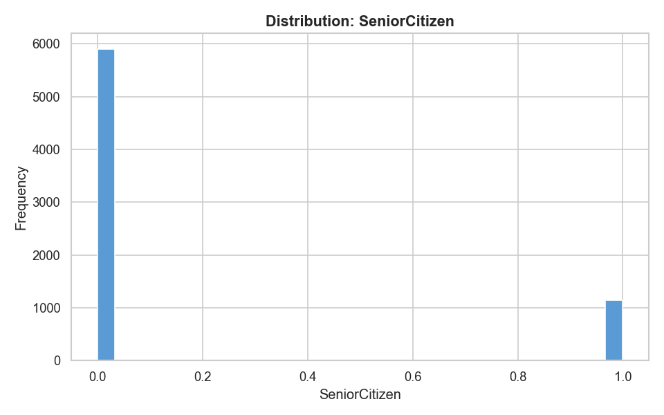
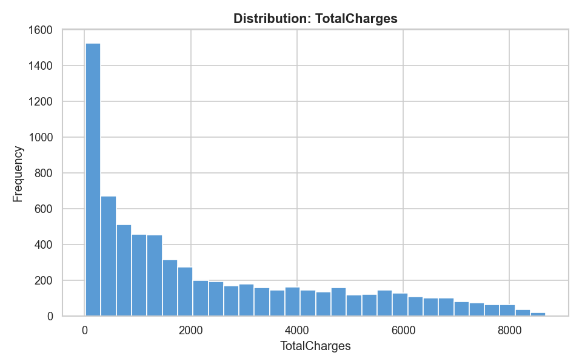
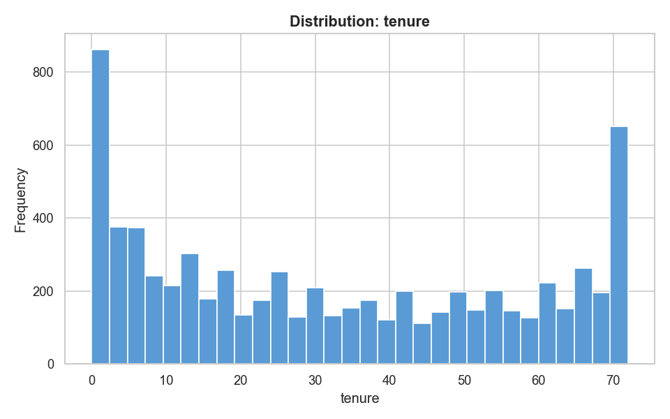
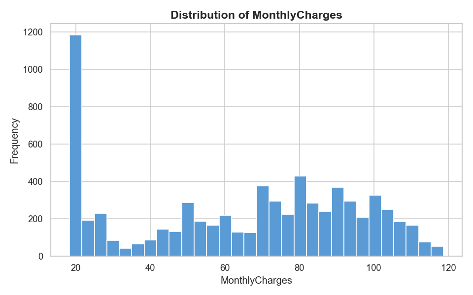
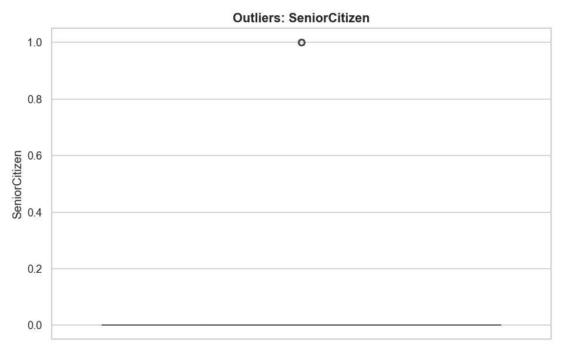
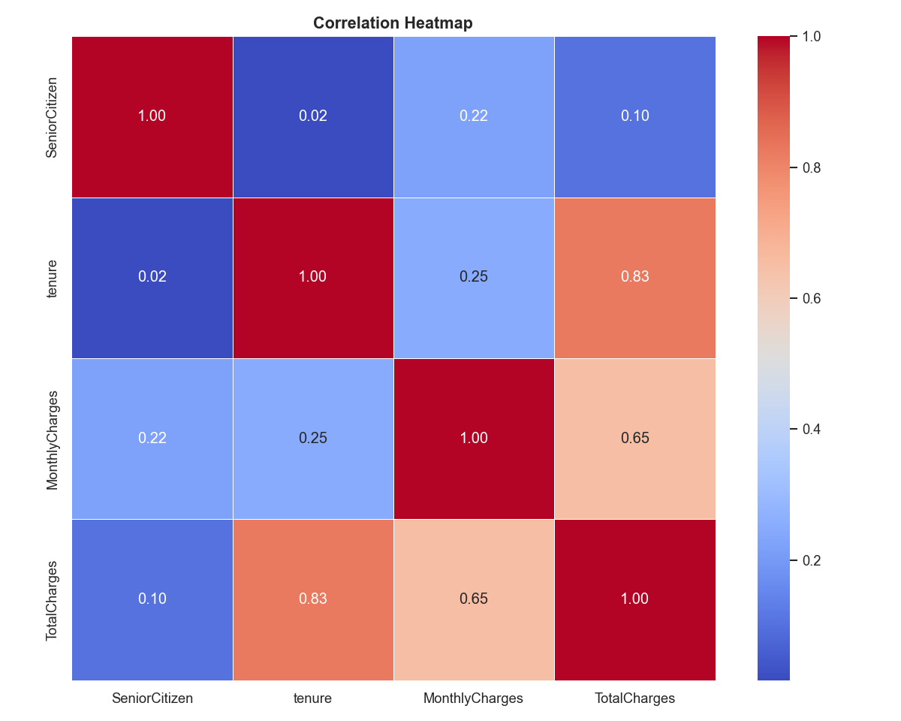
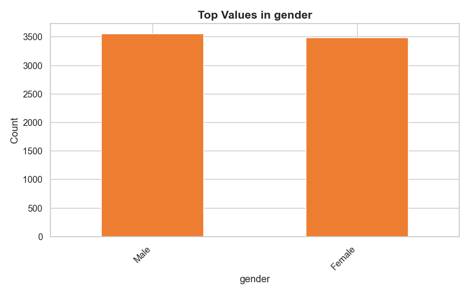
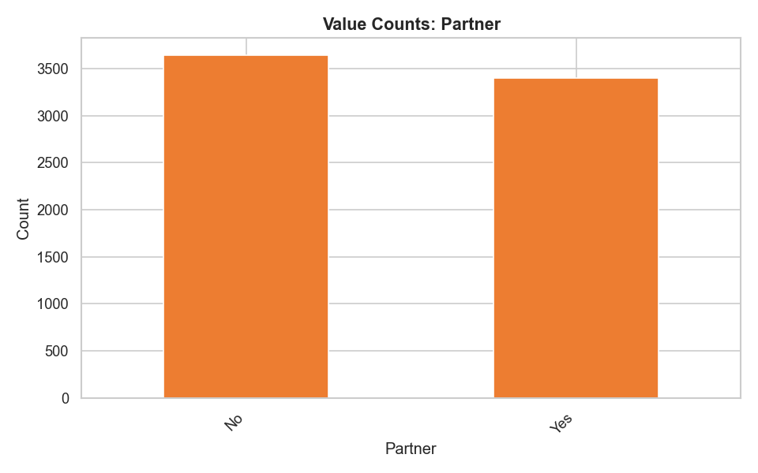
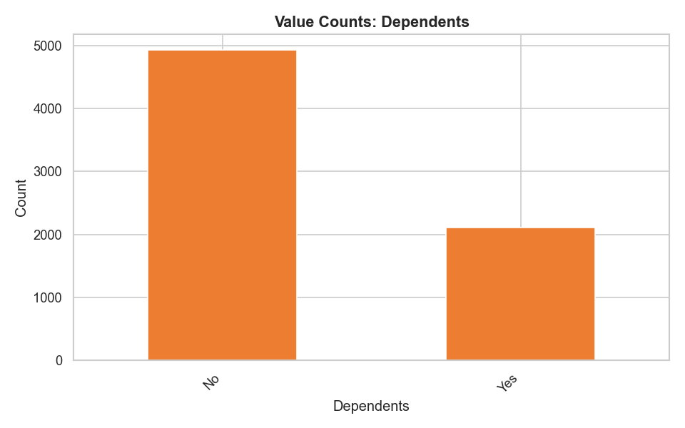

# AI Data Analyst — Analysis Report

**Generated:** 2026-03-21 16:56:01
**Dataset:** `WA_Fn-UseC_-Telco-Customer-Churn`

---
## 1. Dataset Overview

| Metric | Value |
|--------|-------|
| Rows | 7,043 |
| Columns | 21 |
| Duplicate Rows | 0 |
| Missing Columns | 1 |
| Outlier Columns | 1 |

**Dataset Summary:** 7,043 rows x 21 columns

### Column Types

| Column | Type |
|--------|------|
| customerID | object |
| gender | object |
| SeniorCitizen | int64 |
| Partner | object |
| Dependents | object |
| tenure | int64 |
| PhoneService | object |
| MultipleLines | object |
| InternetService | object |
| OnlineSecurity | object |
| OnlineBackup | object |
| DeviceProtection | object |
| TechSupport | object |
| StreamingTV | object |
| StreamingMovies | object |
| Contract | object |
| PaperlessBilling | object |
| PaymentMethod | object |
| MonthlyCharges | float64 |
| TotalCharges | float64 |
| Churn | object |

---
## 2. Data Quality

### Missing Values

| Column | Missing Count | Missing % |
|--------|--------------|-----------|
| TotalCharges | 11 | 0.16% |

### Outliers

| Column | Count | % | Lower Bound | Upper Bound |
|--------|-------|---|-------------|-------------|
| SeniorCitizen | 1142 | 16.21% | 0.0 | 0.0 |

### Strong Correlations (|r| >= 0.7)

| Column A | Column B | r | Direction |
|----------|----------|---|-----------|
| tenure | TotalCharges | 0.8259 | positive |

---
## 3. Key Insights

1. The dataset contains 11 missing values (0.01% of all cells) across the 'TotalCharges' column, which could lead to biased model predictions if not imputed.
2. The 'TotalCharges' column has the highest missing value rate at 0.16%, suggesting a potential data quality issue that may impact analysis and model performance.
3. The strongest correlation in the dataset is between 'tenure' and 'TotalCharges' with an r-value of 0.8259, indicating a strong positive relationship between customer tenure and total charges.
4. The correlation between 'tenure' and 'MonthlyCharges' is 0.2479, a relatively weak positive relationship compared to the 'tenure' and 'TotalCharges' correlation.
5. The 'SeniorCitizen' column has 1,142 outliers (16.21% of all values), which could indicate a data quality issue or a demographic characteristic of the customer base.
6. The mean 'tenure' for customers who are senior citizens is significantly lower (0.1621) than the overall mean 'tenure' of 32.3711, suggesting that senior citizens may be more likely to churn.
7. The standard deviation of 'MonthlyCharges' is 30.09, indicating a relatively high degree of variability in monthly charges across the customer base.
8. The skewness of 'TotalCharges' is 0.9616, indicating a right-skewed distribution with a long tail of high values, which could impact model performance and data interpretation.
9. The 'MonthlyCharges' column has a minimum value of $18.25 and a maximum value of $118.75, suggesting a relatively wide range of monthly charges across the customer base.
10. The skewness of 'tenure' is 0.2395, indicating a relatively normal distribution of customer tenure with a slight skew towards longer tenures.
11. The 'customerID' column has 7,043 unique values, indicating that each customer has a unique ID, which could be useful for customer segmentation and personalization.
12. The 'gender' column has a binary distribution with 3555 customers identified as male and 3488 as female, indicating a relatively balanced distribution of gender across the customer base.

---
## 4. Recommendations

1. Based on the analysis insights, I recommend the following prioritized, concrete, and actionable recommendations:
2. Impute the 'TotalCharges' column with a suitable method (e.g., mean, median, regression)**: The high missing value rate (0.16%) and skewness (0.9616) of the 'TotalCharges' column may impact model performance and data interpretation. WHO: Data Engineers; WHAT: Implement imputation method; WHY: To address potential biases and improve model accuracy.
3. Investigate and address the data quality issue causing the 'SeniorCitizen' outliers (16.21%)**: The large number of outliers in the 'SeniorCitizen' column may indicate a data quality issue or a demographic characteristic of the customer base. WHO: Data Analysts; WHAT: Review data collection processes and interview customers to understand the cause; WHY: To identify and correct errors, and inform targeted marketing strategies.
4. Explore the relationship between 'tenure' and 'TotalCharges' further**: The strong positive correlation (r=0.8259) between 'tenure' and 'TotalCharges' suggests a promising feature for modeling customer behavior. WHO: Data Scientists; WHAT: Develop a regression model to estimate 'TotalCharges' based on 'tenure'; WHY: To identify drivers of customer spending and inform pricing strategies.
5. Develop a segmentation strategy based on 'customerID'**: The unique 'customerID' column can be used to segment customers and inform personalization efforts. WHO: Marketing Team; WHAT: Develop a customer segmentation framework; WHY: To target high-value customers and improve customer satisfaction.
6. Analyze the impact of 'SeniorCitizen' status on customer churn**: The lower mean 'tenure' for senior citizens (0.1621) suggests they may be more likely to churn. WHO: Data Analysts; WHAT: Develop a survival analysis model to estimate churn based on 'SeniorCitizen' status; WHY: To inform targeted retention strategies and reduce churn.
7. Investigate the variability in 'MonthlyCharges'**: The high standard deviation (30.09) of 'MonthlyCharges' suggests variability in customer spending. WHO: Data Analysts; WHAT: Analyze the distribution of 'MonthlyCharges' and identify drivers of variability; WHY: To inform pricing strategies and reduce customer complaints.
8. Develop a clustering model to identify groups of customers with similar characteristics**: The strong correlations between 'tenure' and 'TotalCharges', and 'SeniorCitizen' and 'MonthlyCharges', suggest that customers can be grouped based on their characteristics. WHO: Data Scientists; WHAT: Develop a clustering model to identify customer groups; WHY: To inform targeted marketing strategies and improve customer satisfaction.
9. Monitor and review data quality regularly**: The presence of missing values and outliers in the dataset suggests that data quality is a ongoing concern. WHO: Data Analysts; WHAT: Establish a regular data quality review process; WHY: To prevent errors, ensure data accuracy, and inform business decisions.

---
## 5. Visualizations

> 📁 **Note:** Chart images are saved in `outputs/charts/`.
> To view them, open this report from the project root directory.

### hist_SeniorCitizen.png

### hist_TotalCharges.png

### hist_tenure.png

### hist_MonthlyCharges.png

### box_SeniorCitizen.png

### scatter_tenure_vs_TotalCharges.png

### scatter_MonthlyCharges_vs_TotalCharges.png

### correlation_heatmap.png

### bar_gender.png

### bar_Partner.png

### bar_Dependents.png

### bar_PhoneService.png

