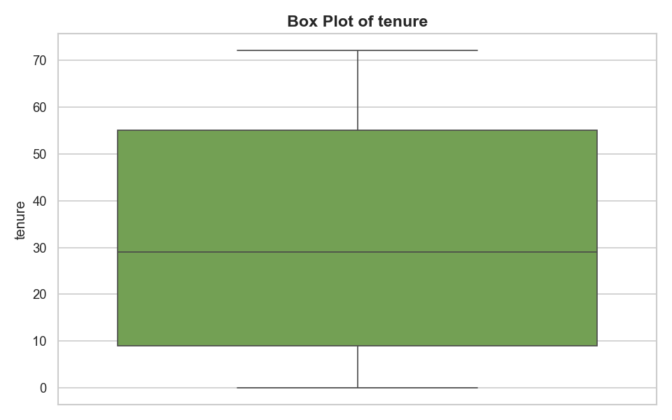
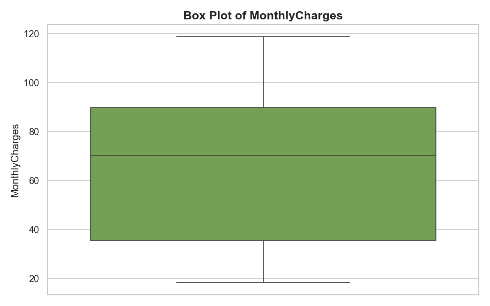
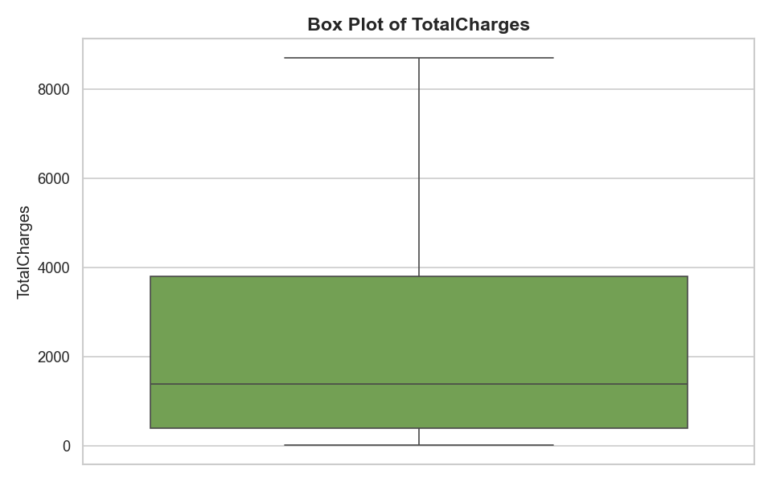
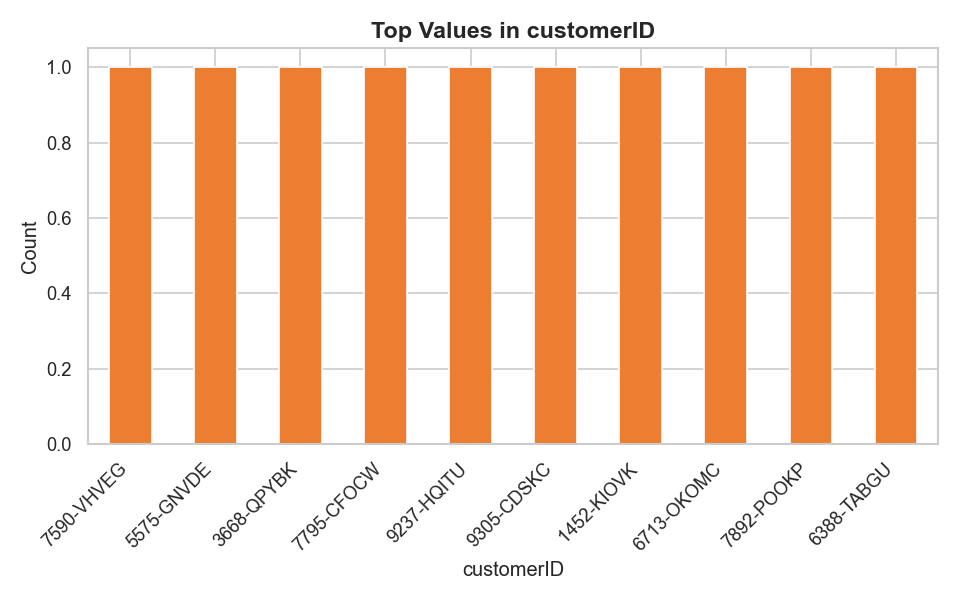

# 📊 AI Data Analyst — Analysis Report

**Generated:** 2026-03-06 14:53:40
**Dataset:** `kaggle:blastchar/telco-customer-churn`

---
## 1. Dataset Overview

| Metric | Value |
|--------|-------|
| Rows | 7,043 |
| Columns | 21 |
| Duplicate Rows | 0 |

### Column Types

| Column | Type |
|--------|------|
| customerID | str |
| gender | str |
| SeniorCitizen | int64 |
| Partner | str |
| Dependents | str |
| tenure | int64 |
| PhoneService | str |
| MultipleLines | str |
| InternetService | str |
| OnlineSecurity | str |
| OnlineBackup | str |
| DeviceProtection | str |
| TechSupport | str |
| StreamingTV | str |
| StreamingMovies | str |
| Contract | str |
| PaperlessBilling | str |
| PaymentMethod | str |
| MonthlyCharges | float64 |
| TotalCharges | float64 |
| Churn | str |

---
## 2. Data Quality Issues

### Missing Values

| Column | Missing Count | Missing % |
|--------|--------------|-----------|
| TotalCharges | 11 | 0.16% |

---
## 3. Key Insights

1. The dataset contains 7,043 rows and 21 columns.
2. 1 column(s) have missing values. 'TotalCharges' has the most with 11 missing (0.16%).
3. Strong positive correlation (0.8259) detected between 'tenure' and 'TotalCharges'.
4. A total of 1,142 outliers were detected across 1 column(s).
5. Column 'SeniorCitizen' has a high outlier percentage (16.21%) — values outside [0.0, 0.0].
6. Column 'gender' is nearly binary with only 2 unique value(s).
7. Column 'Partner' is nearly binary with only 2 unique value(s).
8. Column 'Dependents' is nearly binary with only 2 unique value(s).
9. Column 'PhoneService' is nearly binary with only 2 unique value(s).
10. Column 'PaperlessBilling' is nearly binary with only 2 unique value(s).
11. Column 'Churn' is nearly binary with only 2 unique value(s).

---
## 4. Outlier Analysis

| Column | Outlier Count | % of Column | Lower Bound | Upper Bound |
|--------|--------------|-------------|-------------|-------------|
| SeniorCitizen | 1142 | 16.21% | 0.0 | 0.0 |

---
## 5. Visualizations

### hist_SeniorCitizen.png

### hist_tenure.png

### hist_MonthlyCharges.png

### hist_TotalCharges.png

### box_SeniorCitizen.png

### box_tenure.png

### box_MonthlyCharges.png

### box_TotalCharges.png

### correlation_heatmap.png

### bar_customerID.png

### bar_gender.png

### bar_Partner.png

### bar_Dependents.png

---
## 6. Recommendations

1. Investigate the positive relationship between 'tenure' and 'TotalCharges' (r=0.8259) — consider feature engineering or multicollinearity checks.
2. Review outliers in 'SeniorCitizen' (1142 values, 16.21%) — consider capping, transformation, or removal.
3. The dataset has both numeric and categorical features — consider encoding categorical variables for modeling.
